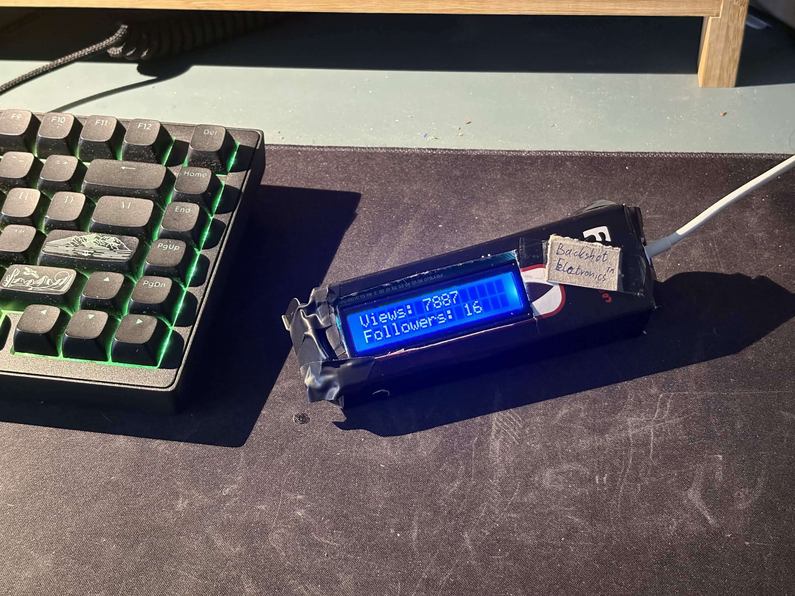

# the doohickey

Shows nekoweb site views and followers on a 16x2 LCD display utilizing a ESP32 Devboard.

# Setup

- duplicate and rename `secrets.example.h` to `secrets.h` and set the wifi ssid and password
- configure the `#define`'s in `main.cpp`
- wire up the LCD display to the I2C bus
- enjoy

